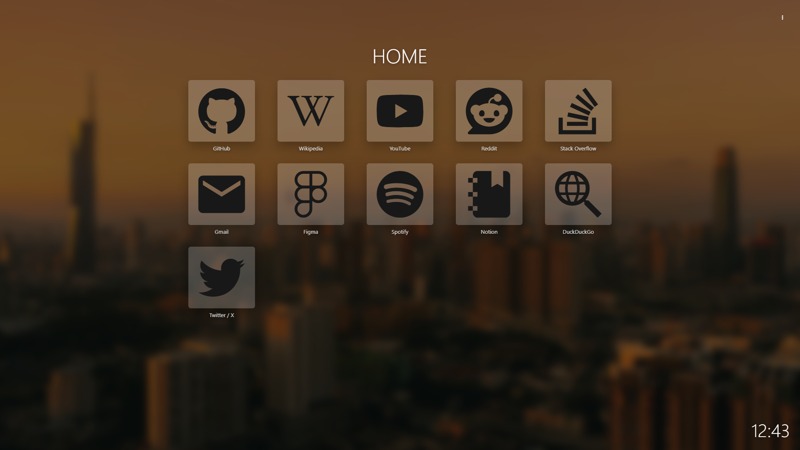
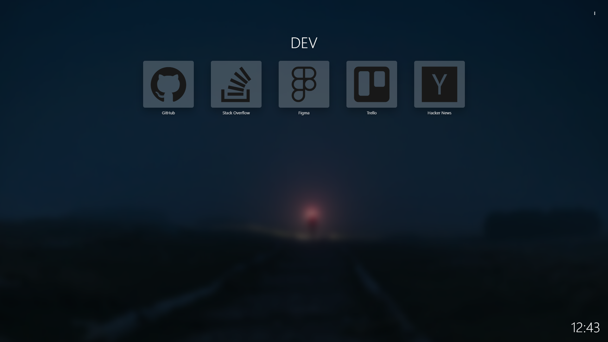
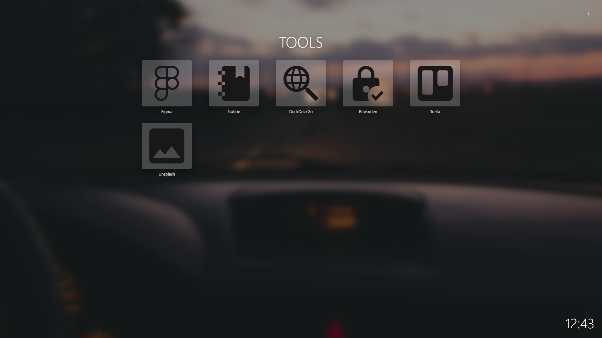
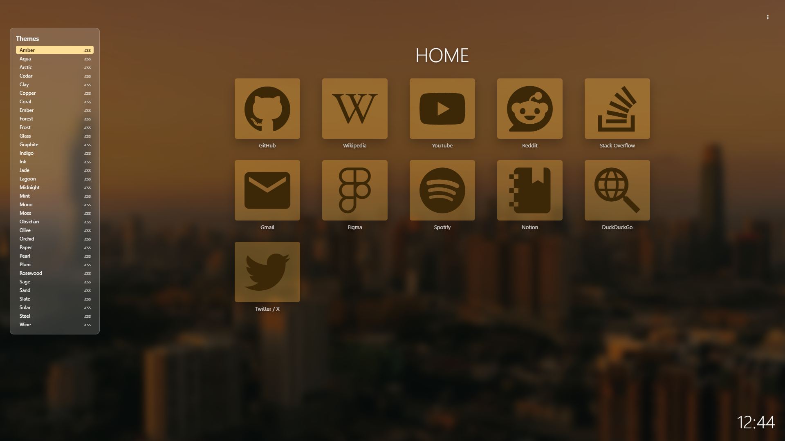
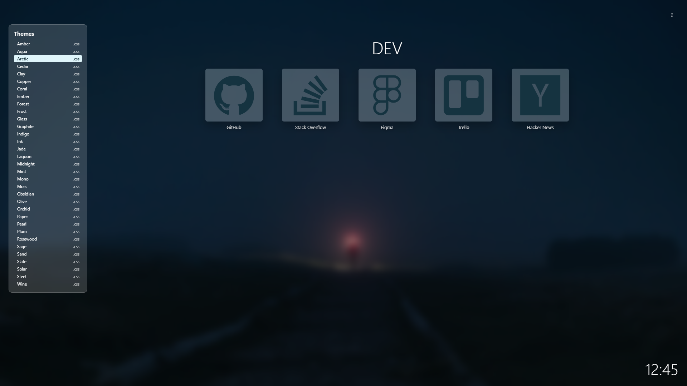
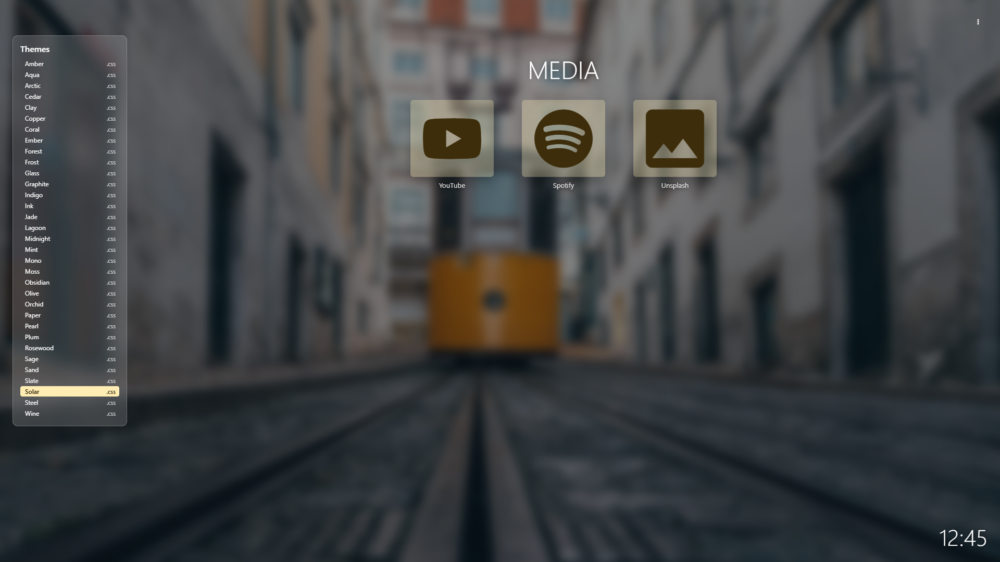
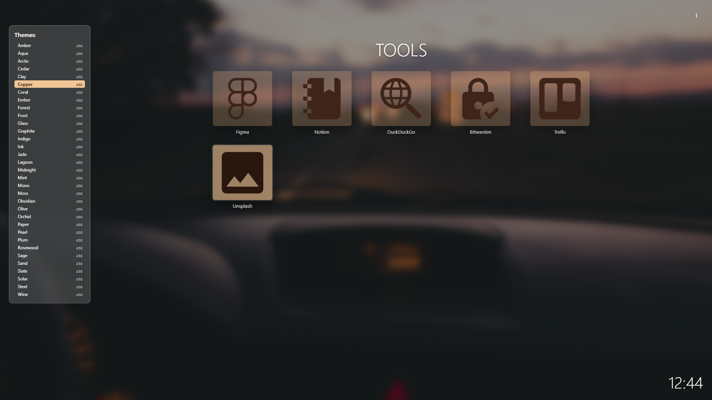

# Tagged Static Startpage

**Язык:** [English](README.md) | Русский

Статическая стартовая страница для браузера, вдохновлённая [Jump](https://github.com/daledavies/jump). Это обычные HTML/CSS/JS-файлы без серверной части. Можно открыть локально как `index.html` или разместить на любом статическом хостинге: GitHub Pages, Netlify, Cloudflare Pages, Nginx, Apache.

## Возможности

- Фильтрация ссылок по тегам: `home`, `tools`, `media`, `social`, `dev`, `cloud`, `docs`.
- Меню тегов справа сверху в стиле Chrome.
- Локальные фоновые изображения для разных тегов.
- Локальный шрифт Nerd Fonts для иконок, без CDN.
- 33 отдельные CSS-темы в `assets/css/themes/`.
- Страница выбора темы: `choose-theme.html`.
- Статические hash-маршруты вида `index.html#tag/dev`.
- Часы в футере.
- Поддержка клавиатуры, skip-link, focus styles и fallback для Popover API.

## Скриншоты

### Стартовая Страница







### Выбор Темы









## Быстрый Старт

1. Откройте `index.html` в браузере.
2. Настройте сайты, теги, иконки и фоны в `assets/data/config.js`.
3. Откройте `choose-theme.html`, чтобы посмотреть темы.
4. Чтобы применить тему, замените подключение CSS-темы в `index.html`:

```html
<link rel="stylesheet" href="assets/css/themes/mono.css">
```

## Структура Проекта

```text
index.html                    Главная стартовая страница
choose-theme.html             Просмотр и выбор темы
favicon.svg
assets/
  css/
    styles.css                Основная раскладка и компоненты
    choose-theme.css          Стили страницы выбора темы
    webfont.css               Локальные классы Nerd Fonts
    themes/                   33 CSS-файла тем
  data/
    config.js                 Сайты, теги, иконки, фоны
  fonts/
    Symbols-2048-em Nerd Font Complete.woff2
  js/
    app.js                    Основная логика страницы
    backgrounds.js            Выбор фона и preload
    choose-theme.js           Логика выбора темы
images/                       Локальные фоновые изображения
```

## Настройка

Все данные стартовой страницы находятся в `assets/data/config.js`.

Пример сайта:

```js
{
  name: "GitHub",
  url: "https://github.com/",
  description: "Code hosting & collaboration",
  tags: ["home", "dev"],
  iconClass: "nf-dev-github"
}
```

Пример фоновых изображений:

```js
tagBackgrounds: {
  home: { url: "images/andreas-gucklhorn-EDxp0LDjKAM-unsplash.jpg" },
  tools: { url: "images/anton-darius-gWXyJ9k5ak8-unsplash.jpg" },
  dev: { url: "images/marek-piwnicki-wOOe-GLA_YU-unsplash.jpg" }
}
```

## Теги

- `home` — главная страница по умолчанию.
- Сайты с тегом `home` отображаются на главной.
- Любой другой тег фильтрует список сайтов.
- Текущий тег сохраняется в URL как `#tag/dev`.
- В интерфейсе теги отображаются большими буквами и без `#`.

## Иконки

Иконки используют локальный шрифт [Nerd Fonts](https://www.nerdfonts.com/cheat-sheet). Входящий в комплект файл
`assets/css/webfont.css` генерируется из файла `assets/fonts/Symbols-2048-em Nerd Font Complete.woff2`
и включает классы для глифов, доступных в этом шрифте.

Иконка задаётся через `iconClass`, например:

```js
iconClass: "nf-md-cloud"
```

## Темы

Каждая тема — отдельный CSS-файл в `assets/css/themes/`. Тема по умолчанию:

```html
<link rel="stylesheet" href="assets/css/themes/mono.css">
```

Откройте `choose-theme.html`, чтобы посмотреть все темы. Повторный клик по активной теме переключает фон предпросмотра.

## Хостинг

Страница полностью статическая. Hash-маршруты вроде `#tag/dev` не требуют настройки сервера.

Если нужны чистые пути вида `/tag/dev/`, настройте сервер так, чтобы он отдавал `index.html` для всех маршрутов.

## Авторы Изображений

Фоновые фотографии в `images/` взяты с [Unsplash](https://unsplash.com). Профили фотографов:

- [Abolfazl Ranjbar](https://unsplash.com/@ranjbarpic)
- [Alim](https://unsplash.com/@apyfz)
- [Andreas Gücklhorn](https://unsplash.com/de/@draufsicht)
- [Anton Darius](https://unsplash.com/@thesollers)
- [Ben Carless](https://unsplash.com/@bencarless)
- [Cash Macanaya](https://unsplash.com/@cashmacanaya)
- [Damian Markutt](https://unsplash.com/@wildandfree_photography)
- [Jan Stýblo](https://unsplash.com/@janstyblo)
- [Jonathan Bean](https://unsplash.com/@jonathanbean)
- [Marek Piwnicki](https://unsplash.com/@marekpiwnicki)
- [Maud Bocquillod](https://unsplash.com/@maud_boc)
- [Michelle Spollen](https://unsplash.com/@micki)
- [NASA](https://unsplash.com/@nasa)
- [Philipp Düsel](https://unsplash.com/@philipp_dice)
- [Tropic Alizé](https://unsplash.com/@tropicalize)

## Совместимость

- Popover API используется, если доступен.
- Для старых браузеров есть fallback на открытие меню через CSS-класс.
- View Transitions используются, если доступны; иначе контент обновляется без анимации.
- Если включено `prefers-reduced-motion: reduce`, анимации сокращаются.

## Благодарности

Создано при помощи Codex, opencode и скилла `modern-web-guidance`.
